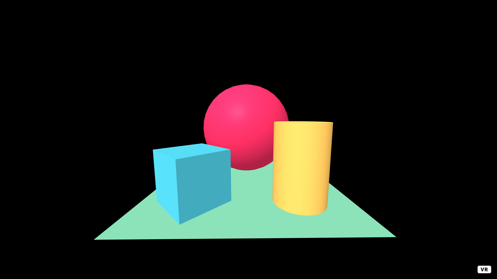
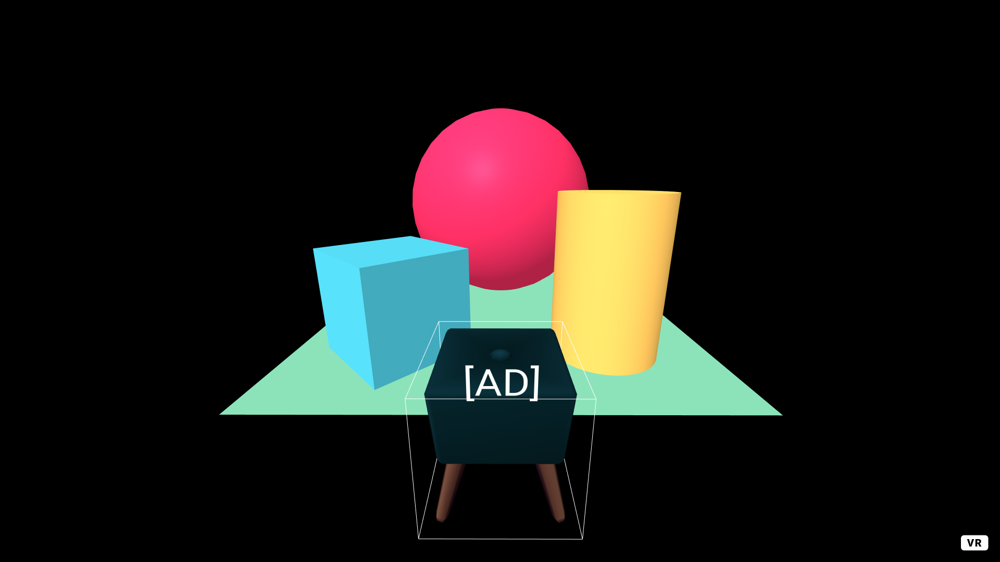

## AdCube

**AdCube** is a JavaScript library that <u>effectively prevents threats from third-party advertising (ad) services in WebVR environments.</u> It protects first-party sensitive resources by sandboxing ad-serving JS scripts so that ad scripts in WebVR cannot conduct malicious attacks (e.g. *Blind spot tracking attack*, *Gaze and Controller cursor jacking attack*, *Auxiliary display attack*). It is designed to impose a negligible performance overhead to a WebVR website. A detailed description of this technique can be found in the submission.

- Blind spot tracking attack: A malicious ad service provider places ad objects in the opposite direction of a user's current sight.
- Gaze and Controller cursor jacking attack: These two attacks allow the third-party library to create another fake input channel, such as gaze-cursor or controller, to trick users in VR scene and make one input invisible. An attacker can exploit this hidden input in an ad fraud attack when a user enjoys the VR game with another visible input. 
- Auxiliary display attack: Exploits the inability of the users to view the main display when the user enters VR mode.

See section [Presented Attacks & Defense](#presented-attacks--defense) for examples of attacks.

## Ad Showcase

This is an example of AdCube applied. Each ad is confined within a cube, and each third-party script is sandboxed via AdCube. [Watch the high-quality video](https://youtu.be/UpUIjP8v58s)


## Presented Attacks & Defense

- Blind spot tracking attack
  - [Attack](https://youtu.be/7xcAkiX_brw)
  - [Defense](https://youtu.be/kW04seT-4Lc)
- Gaze cursor-jacking attack
  - [Attack](https://youtu.be/umqaHUSicIA)
  - [Defense](https://youtu.be/SDEnxrnRa1A)
- Controller cursor-jacking attack
  - [Attack](https://youtu.be/HsqU-4XHoqk)
  - [Defense](https://youtu.be/0kJTQBjZh7A)
- Auxiliary display attack
  - [Attack](https://youtu.be/_dOay_Bg2g8)
  - [Defense](https://youtu.be/zvZoHa7FYD4)

## Requirement

The only dependency to use the AdCube is enough to import [caja](https://developers.google.com/caja). In other words, you can add the following code to the host page to get ready for the AdCube.

```html
<script src="//caja.appspot.com/caja.js"></script>
```

The WebVR library currently supported by AdCube is as follows, and unsupported libraries will be supported later.

|            | A-Frame |  Three.js  |
| :--------: | :-----: | :--------: |
| **AdCube** | Support | Under Dev. |

## Usage

- Before applying AdCube (Example - index.html)

  ```html
  <html>
    <head>
        <!-- A-Frame library -->
        <script src="//aframe.io/releases/1.0.4/aframe.min.js"></script>
        <script src="//cdn.jsdelivr.net/npm/aframe-extras@6.0.1/dist/aframe-extras.min.js"></script>
        <script src="//unpkg.com/aframe-environment-component@1.1.0/dist/aframe-environment-component.min.js"></script>
    </head>
    <body>
    <a-scene>
      <a-box position="-1 0.5 -3" rotation="0 45 0" color="#4CC3D9"></a-box>
      <a-sphere position="0 1.25 -5" radius="1.25" color="#EF2D5E"></a-sphere>
      <a-cylinder position="1 0.75 -3" radius="0.5" height="1.5" color="#FFC65D"></a-cylinder>
      <a-plane position="0 0 -4" rotation="-90 0 0" width="4" height="4" color="#7BC8A4"></a-plane>>
      <a-sky color="#000000"></a-sky>
    </a-scene>
  </body>
  </html>
  ```

  

---

- After applying AdCube (Example - index.html)

  ```html
  <html>
    <head>
        <!-- A-Frame library -->
        <script src="//aframe.io/releases/1.0.4/aframe.min.js"></script>
        <script src="//cdn.jsdelivr.net/npm/aframe-extras@6.0.1/dist/aframe-extras.min.js"></script>
        <script src="//unpkg.com/aframe-environment-component@1.1.0/dist/aframe-environment-component.min.js"></script>

        <!-- AdCube -->
        <script src="//caja.appspot.com/caja.js"></script>
        <script type="module" src="boundingbox.js"></script>
        <script src="adcube_for_aframe.js"></script>
    </head>
    <body>
    <a-scene>
      <a-box position="-1 0.5 -3" rotation="0 45 0" color="#4CC3D9"></a-box>
      <a-sphere position="0 1.25 -5" radius="1.25" color="#EF2D5E"></a-sphere>
      <a-cylinder position="1 0.75 -3" radius="0.5" height="1.5" color="#FFC65D"></a-cylinder>
      <a-plane position="0 0 -4" rotation="-90 0 0" width="4" height="4" color="#7BC8A4"></a-plane>
      <a-sky color="#000000"></a-sky>
      <a-adcube position="0 0 -2" width="1" height="1" depth="1"></a-adcube>
    </a-scene>
    <script>
      const adcube = AdCube();
      adcube.load('advertisement.js'); // Advertisement loader
    </script>
  </body>
  </html>
  ```

- After applying AdCube (Example - advertisement.js)

  ```javascript
  function loadAdvertisement() {
    var e = createElement('a-gltf-model');
    var gltfId = loadObject('assets/chair/scene.gltf'); // Advertisement object path
    e.setAttribute('src', gltfId);
    addElement("ad-1", e);
  }
  loadAdvertisement();
  ```

  
